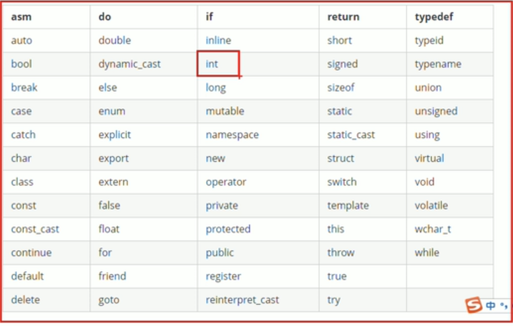
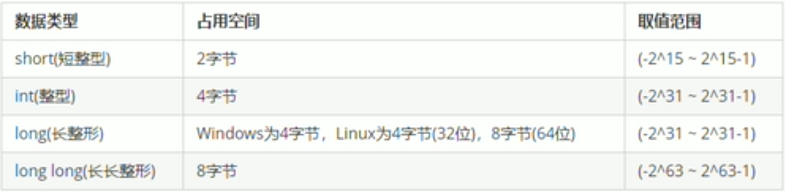

# C++课程学习

## 第一阶段

#### 一 . C++基础语法

学习基础的语法,通讯录管理系统


1.1

vs配置clang的文件位置

问题:

检测到 #include 错误。请更新 includePath

按下command + shift + p ， 选择C/C++编辑配置(JSON)

```properties
g++ -v -E -x c++ -
```

将终端的输出配置到c_cpp_properties.json中


第一个代码

```c++
#include <iostream>
using namespace std;

int main()
{
    cout << "hello world" << endl;
    system("pause");
    return 0;
}
```


1.2注释

单行注释

多行注释  

```c++
#include <iostream>
using namespace std;
//1.单行注释

//2.多行注释

/*
    main是一个程序的入口
    每个程序都必须有这么一个函数
    有且仅有一个
*/

int main()
{
    //在屏幕中输出一个hello world
    cout << "hello world" << endl;
    system("pause");
    return 0;
}
```


1.3 变量

作用:给一段指定的命名空间起名,方便操作这段内存

语法: 数据类型 变量名 =  初始值;

```c++
#include <iostream>
using namespace std;

int main()
{
    int a = 10;
    cout << "a=" << a << endl;
    system("pause");
    return 0; 
}
```


变量就是为内存空间起一个名字,方便之后获取内存空间中的值


1.4常量

用于记录程序中不可更改的数据

C++定义常量的两种方式:

1,#define 宏常量 , #define 常量名 常量值

通常在文件上方定义,表示一个常量

2,const 修饰变量 const 数据类型  常量名 = 常量值

通常在变量定义前加上关键字const,修饰该变量为常量, 不可修改

```c++
#include <iostream>
using namespace std;
//宏常量
#define Day 7

int main()
{ 
    //常量一旦进行了修改就会出错
    //Day = 12;
    
    cout << "一周有" << Day << "天" << endl;
    //const修饰的变量不能被修改
    // month = 13;
    const int month = 12 ; 
    cout << "一年有" << month << "个月" << endl;
    
    return 0;
}
```


1.5 关键字

作用:关键字是在C++中预先保留的单词(我们在定义变量和常量的时候不要使用这些关键字)

 




1.6 标识符号的命名规则

1,标识符不可以是关键字

2,标识符是由字母,数字,下划线组成

3,标识符第一个字符只能是字母和下划线

4,标识符是区分大小写的

(给标识符起变量名字的时候最好能够见名知意)


#### 二 . 数据类型

C++规定在创建一个变量或者常量的时候,必须指定出相应的数据类型,否则无法给变量分配内存

2.1 整型

作用:整型变量表示的是整数类型的数据

C++中能够表示整型的类型有下面几种方式,区别在于所占用的内存空间不足:




数据类型存在的意义:
给变量分配合适的内存空间:


2.2 sizeof关键字

 作用:利用sizeof关键字可以统计数据类型所占空间的大小

语法:sizeof(数据类型/变量)


```C++
#include <iostream>
using namespace std;

int main()
{
    //整型: short 2字节 int 4字节 long 4字节 long long 8字节
    //可以利用sizeof求出数据类型占用的大小
    //语法 sizeof(数据类型/变量)
    short num1 = 10;
    cout << "short占用的内存空间:" << sizeof(short) << endl;
    cout << "short占用的内存空间:" << sizeof(num1) << endl;
    cout << "int占用的内存空间:" << sizeof(int) << endl;
    cout << "long占用的内存空间:" << sizeof(long) << endl;
    cout << "long long占用的内存空间:" << sizeof(long long) << endl;
}
```


2.3 实型(浮点型)

作用: 用于表示小数

浮点型变量分为两种:

1,单精度float

2,双精度double

两者的区别在于表示数字的有效位数不同


```c++
#include <iostream>
using namespace std;

int main()
{
  //1.单精度
  //2.双精度
  //默认情况下:输出一个小数会显示6位有效数字 
    float a = 3.1415926f;
    cout << "单精度小数:" << a << endl;

    double b = 3.1415926;
    cout << "双精度小数:" << b << endl; 

    cout << "单精度小数:" << sizeof(float) << endl;
    cout << "双精度小数" << sizeof(double) << endl;

    //科学计数法
    float f2 = 3e2; // 3*10^2
    cout << "f2=" << f2 << endl;

    double f3 = 3e-2; // 3*0.1^2
    cout << "f3=" << f3 << endl;

    system("pause");

    return 0;
}
```


2.4字符型

作用:字符型变量用于显示单字符

语法:char ch = ‘a’;

> 一个字符只能使用单引号 


```C++
#include <iostream>
using namespace std;

int main(){
    //字符的声明变量
    char c = 'a';
    cout << "输出的字符是" << c << endl;
    //字符的占用
    cout << "字符占用" << sizeof(c) << endl;
    //字符常见的错误
    //不能用双引号
    //char a = "v";
    //不能在单引号里面写很多字符
    char v = 'asddsfsadas';
    cout << v << endl;

    //字符在底层是用ascii码储存的
    //a --> 97
    //A --> 65
    char s = 'a';
    cout << "a的ASCII码是" <<(int)s << endl;
}
```

2.5转义字符

作用:用于显示一些不能显示出来的ASCII码

现阶段我们常用的转义字符:  \n , \\\ , \t

```C++
#include <iostream>
using namespace std;

int main
 (){
    //c++中endl有\n的效果
    cout << "hello world" << endl;
    cout << "hello world\n";
    // 打印出 "\\"
    cout << "\\" << endl;

    //制表符一共占用了8个空间 作用就是可以整齐的输出字符
    cout << "aa\tas" << endl;
 }
```


2.6字符串型

作用:用于表示一串字符

```C++
 #include <iostream>
//需要使用string的时候需要
#include <string> 
using namespace std;

int main (){
    //C语言风格
    //注意事项 : char 字符串名[] 
    char str[] = "hello world\n";
    cout << "C语言风格" << str;
    //C++语言风格
    string str2 = "hello world";
    cout << "C++语言风格" << str2;
}
```


2.7布尔类型bool

作用: 布尔数据类型代表或真或假

bool类型只有两个值

* ture 真 本质是1
* false假 本质是0

bool类型只占一个字节

```c++
#include <iostream>
using namespace std;

int main(){
    //bool变量的声明
    bool flag = true;
    cout << flag << endl;

    flag = false;
    cout << flag << endl;
    //bool变量占用的字符
    cout << "bool类型所占的空间" <<sizeof(flag) << endl;
}
```


2.8数据的输入

作用:用于从键盘获取数据

关键字: cin

```C++
#include <iostream>
#include <string>
using namespace std;

int main(){
    //整型
    int a = 0;
    cout << "请给整型赋值" << endl;
    cin >> a;
    cout << "整型a = " << a << endl;
    
    //浮点型
    float b = 0;
    cout << "请给浮点型数据赋值" << endl;
    cin >> b;
    cout << "浮点型数据b = " << b << endl;
    
    //字符型
    char c = 'a';
    cout << "请给字符型数据赋值" << endl;
    cin >> c;
    cout << "字符型数据c = " << c << endl;
    
    //字符串型 
    string st = "hello world";
    cout << "请给字符串型数据赋值" << endl;
    cin >> st;
    cout << "字符串型数据st = " << st << endl;

    //bool类型
    //除0为否,其他都是1
    bool z = true;
    cout << "请给bool型数据赋值" << endl;
    cin >> z;
    cout << "bool类型数据z = " << z << endl;
}
```


## 第二阶段

C++核心编程

了解面向对象编程

职工管理系统


## 第三阶段

C++提高编程

了解C++的泛型编程和STL的基本使用 

演讲比赛系统


综合案例:机房预约系统


#### 关于引用的作为参数

使用引用参数的两个主要原因是：

1）程序员能够修改调用函数中的数据对象。

2）通过传递引用而不是整个数据对象，可以提高程序的运行速度。


参数传递的指导原则：

对于使用传递的值而不做修改的函数：

1）如果数据对象很小，如内置数据类型或小型结构，则按值传递。

2）如果数据对象是数组，则使用指针，因为这是唯一的选择，并将指针声明为const的指针。

3）如果数据对象是较大的结构，则使用指针或者引用，提高程序运行效率。这样可以节省复制结构所需的时间和空间。

4）如果数据对象是类对象，则使用const引用，类设计的语义常常要求使用引用。、


对于修改调用函数中数据的函数：

1）如果数据对象是内置数据类型，则使用指针。

2）如果数据对象是数组，则只能使用指针。

3）如果数据对象是结构，则使用指针或引用。

4）如果数据对象是类对象，则使用引用。